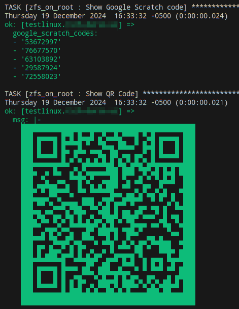
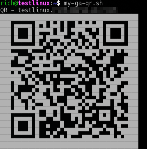

# Google Authenticator Settings

[Back to README.md](../README.md)

## Edit `defaults/main.yml` to Configure Google Authenticator

```yaml
###############################################################################
# Google Authenticator Settings
###############################################################################
# Google Authenticator is only installed if at least one user is defined above
# with it enabled, and is only used (by default) for password sessions not cert
# based sessions.

# Set the nullok parameter for pam_google_authenticator.so in /etc/pam.d/sshd
# When true, this allows password logins if no ~/.google_authenticator exists
# If false, then users can NOT login until ~/.google_authenticator is created.
google_auth_nullok: true

# Force user to use authenticator even with SSH key
google_auth_force: false

# Default label and issuer if not defined in inventory file for the host(s)
# NOTES: 1) Be sure to use char encoding for spaces such as "Example%20Inc."
#        2) "{{ username }}" is replaced with the "user_id" defined above.
google_auth_label: "{{ inventory_hostname }}:{{ username }}"
google_auth_issuer: "Ubuntu"
```

* When `google_auth_nullok: true` then usage of Google Authenticator is optional.  Users can decide to use it or not. When set to `false` it is required and users can not login if without an authenticator secret `.google_authenticator` file defined.
* When `google_auth_force: false` then only users authenticating via a password who have an authenticator secret `.google_authenticator` will be prompted for the number token.  If they authenticate via an ssh-key MFA is not used.
* When `google_auth_force: true` then a user with an authenticator secret `.google_authenticator` will be prompted for the number token for both password and ssh-key based authentication.
* `google_auth_label` defines the name shown in the Authenticator Application. By default it is the short hostname of the server and the user name.  This can be changed, but any spaces must be character encoded as shown in the comment example.

---

### Installation

NOTE: Google Authenticator will only be installed if at least one defined user under `regular_user_accounts` has the `google_auth: true` set.  If no users have this set or all users are set to `false` it will not be installed.

* When installed it will only apply to users who have `google_auth: true` set.
* An ansible task will run at install time to create the authenticator secret `.google_authenticator` in the root of the users home directory.
* In additional at install time within the ansible console will show the QR code for each user and their respective recovery codes:



A user with an authenticator secret `.google_authenticator` in the root of their home drive can generate the QR code again, a helper script has been provided at `/usr/local/bin/my-ga-qr.sh`:



### Manually Create or Recreate Secret

An authenticator secret `.google_authenticator` can be created or recreated at any time using the provided script `/user/local/bin/ga-create-config.sh`.

```shell
# See if secret already exists
$ ga-create-config.sh
Google Authenticator secret already exists: /home/rich/.google_authenticator, use script 'my-ga-qr.sh' to view it.

# Let delete secret and create a new one
$ rm /home/rich/.google_authenticator
rm: remove write-protected regular file '/home/rich/.google_authenticator'? y

# Now try again to create a new secret
$ ga-create-config.sh
```


* Make note of the backup recovery codes to use in an emergency.

### Testing Google Authenticator

* Enter the Google Authenticator code at the `Verification code:` prompt:

```shell
$ ssh rich@testlinux
(rich@testlinux.example.com) Verification code:
```

If the code is accepted, you will get the login screen:

```shell
Welcome to Ubuntu 24.04.1 LTS (GNU/Linux 6.8.0-50-generic x86_64)

 * Documentation:  https://help.ubuntu.com
 * Management:     https://landscape.canonical.com
 * Support:        https://ubuntu.com/pro
Last login: Sun Dec 22 20:40:10 2024 from 192.168.10.100
```

* Google Authenticator is successfully working.

[Back to README.md](../README.md)
